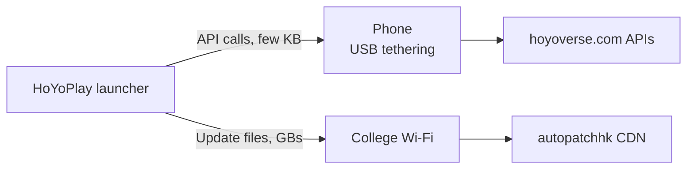

My college network blocks games, most VPNs, Cloudflare, and half the Chinese internet. So you'd expect Genshin to be dead on campus. It isn't. The game itself runs fine. What doesn't run is the HoYoPlay launcher, which means no updates, and Genshin won't let you in on an old version.

Normally my backup would be mobile data. Except where I live, mobile data is more of a rumour than a network, and a Genshin update is several gigabytes. That wasn't happening.

So today I sat down, with Claude as my rubber duck, to see if I could get updates through college Wi-Fi anyway. Spoiler: I could. But the fix was *nothing* like what I expected.

## It was never about DNS

My first instinct was the usual one: switch DNS servers and hope. Instead, I wrote a small script to find out *how* the launcher was being blocked. It asked a dozen different DNS servers where the launcher's servers live, then actually tried connecting to every address it got back.

The results split cleanly in two. The servers that hold the actual update files, `autopatchhk.yuanshen.com`, were completely fine. Every address connected. But the launcher's API servers on `hoyoverse.com`, the ones that tell it *what* to download, failed every single time.

And they failed in a strange way. Whichever address I tried, the server came back with the wrong security certificate. Real servers don't all do that at once. What was really going on: the firewall was reading the site's name as I connected, and swapping in its own certificate to block it.

So no DNS trick was ever going to work. The firewall didn't care *where* I was connecting. It cared about the name.

## The blocked part was tiny

This is where it clicked. The launcher does two very different things. First it asks a couple of questions: *is there an update? which files do I need?* That's a few kilobytes. Then it downloads the files themselves, which is gigabytes.

The firewall was blocking the questions, not the downloads.

So my phone didn't need to carry the whole update. It only needed to carry the questions. Even my awful mobile signal can manage a few kilobytes, and the gigabytes could stay on college Wi-Fi, where they were already allowed.

## One laptop, two networks

So that's what I set up. The laptop stays on college Wi-Fi, and my phone plugs in over USB tethering as a second connection. Then a Python script tells Windows which traffic goes where.

```powershell
PS C:\Users\shrey\Downloads> python hoyo_split.py adapters

  Index  Guess    IP               Gateway          Name                   Description
  46     phone    [Redacted]    [Redacted]     Ethernet 2             Remote NDIS based Internet Sharing Device
  7      college  [Redacted]    [Redacted]      Wi-Fi                  Intel(R) Wi-Fi 7 BE201 320MHz
```

The first thing it does is keep Wi-Fi in charge. Windows loves a wired connection, so the moment you plug in a phone it quietly starts sending *everything* through it. The script pushes the phone back to backup duty. Then it checks each launcher server on Wi-Fi, and only the blocked ones get sent through the phone. For each of those it picks one address, adds a route for just that address through the phone, and pins it in the hosts file so the launcher always uses it.

```powershell
PS C:\Users\shrey\Downloads> python hoyo_split.py discover
[.] Open the launcher NOW and click update / check for updates.
    Watching the DNS cache for 90s (Ctrl+C to stop early)...
    + sentry.eks.hoyoverse.com
    + sg-public-data-api.hoyoverse.com
    + sg-hyp-api.hoyoverse.com
    + minor-api-os.hoyoverse.com
    + apm-api.hoyoverse.com
    + autopatchhk.yuanshen.com

[+] Saw 40 domains total, 6 HoYo-related.
[.] Testing each HoYo domain on your current network...
    ok       apm-api.hoyoverse.com
    ok       autopatchhk.yuanshen.com
    ok       minor-api-os.hoyoverse.com
    BLOCKED  sentry.eks.hoyoverse.com  (HTTP failed (TimeoutError))
    ok       sg-hyp-api.hoyoverse.com
    ok       sg-public-data-api.hoyoverse.com

[+] Saved 1 blocked domain(s) to hoyo_domains.txt. Now run: python hoyo_split.py setup
PS C:\Users\shrey\Downloads>    Add-Content hoyo_domains.txt "minor-api-os.hoyoverse.com","apm-api.hoyoverse.com"
```

Before trusting any of it, the script connects to each address through the phone and makes sure the certificate is the real one. And when I'm done updating, one command puts everything back the way it was.



The launcher never knows anything changed. It just sees its requests succeed.

```powershell
PS C:\Users\shrey\Downloads>    python hoyo_split.py setup --phone-if 46 --college-if 7
[+] Phone:   Ethernet 2 (Remote NDIS based Internet Sharing Device), gateway [redacted]
[+] College: Wi-Fi (Intel(R) Wi-Fi 7 BE201 320MHz), gateway [redacted]
[+] College Wi-Fi is the default route; phone is backup only.

[.] Checking 8 domain(s) on college Wi-Fi...
    BLOCKED sg-hyp-api.hoyoverse.com  (certificate swapped (firewall interception))
    BLOCKED sg-public-api.hoyoverse.com  (certificate swapped (firewall interception))
    BLOCKED hyp-webstatic.hoyoverse.com  (certificate swapped (firewall interception))
    BLOCKED sg-downloader-api.hoyoverse.com  (certificate swapped (firewall interception))
    BLOCKED sg-public-data-api.hoyoverse.com  (certificate swapped (firewall interception))
    BLOCKED sentry.eks.hoyoverse.com  (certificate swapped (firewall interception))
    BLOCKED minor-api-os.hoyoverse.com  (certificate swapped (firewall interception))
    BLOCKED apm-api.hoyoverse.com  (certificate swapped (firewall interception))

[.] Routing 8 domain(s) through the phone (this can be slow)...
    OK      sg-hyp-api.hoyoverse.com -> 18.161.125.100 via phone
    OK      sg-public-api.hoyoverse.com -> 108.159.46.10 via phone
    OK      hyp-webstatic.hoyoverse.com -> 108.159.28.25 via phone
    OK      sg-downloader-api.hoyoverse.com -> 108.159.46.100 via phone
    OK      sg-public-data-api.hoyoverse.com -> 108.159.28.124 via phone
    OK      sentry.eks.hoyoverse.com -> 13.215.164.238 via phone
    OK      minor-api-os.hoyoverse.com -> 108.159.46.113 via phone
    OK      apm-api.hoyoverse.com -> 108.159.91.106 via phone

[+] Done. 8 domain(s) go through your phone; everything else (including downloads) stays on college Wi-Fi.
    Now fully quit the launcher (also from the system tray), reopen it, and update.
    When you're done: python hoyo_split.py undo
```

## 90 Mbps on Wi-Fi, zero on the phone

I reopened the launcher and watched Task Manager. The update was pulling around 90 Mbps over college Wi-Fi, while the phone connection sat at 0 Kbps. The launcher's questions are so small they don't even show up on the graph.

What stays with me is how wrong my first guess was. I thought "Genshin is blocked." It wasn't. Eight small servers were blocked, and everything heavy was fine. If I'd spent the evening trying random DNS servers, I'd still be stuck. Finding out exactly *what* was blocked, and *how*, is what made the fix obvious.

Also, my useless mobile data finally has a job. Terrible for gigabytes, perfect for kilobytes.
<figure>
  
  <figcaption>Task Manager Network tab</figcaption>
</figure>
